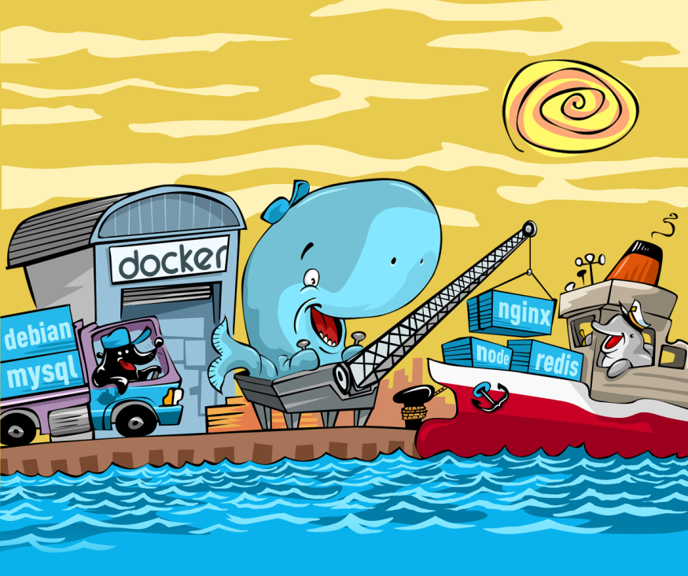
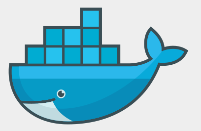

# Docker

---

## O que é o Docker

É uma ferramenta que se apoia em recursos existentes no kernel, inicialmente Linux, para isolar
a execução de processos. 

As ferramentas que o Docker traz são basicamente uma camada de administração de containers, baseado originalmente no LXC.

Alguns isolamentos possíveis

* Limites de uso de memória
* Limites de uso de CPU
* Limites de uso de I/O
* Limites de uso de rede
* Isolamento da rede (que redes e portas são acessíveis)
* Isolamento do file system
* Permissões e Políticas
* Capacidades do kernel

---

## Definição oficial:

*Containers Docker empacotam componentes de software em um sistema de arquivos completo, que contêm tudo necessário para a execução: código, runtime, ferramentas de sistema - qualquer coisa que possa ser instalada em um servidor.*

*Isto garante que o software sempre irá executar da mesma forma, independente do seu ambiente.*

---

