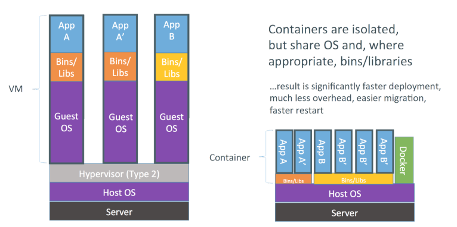
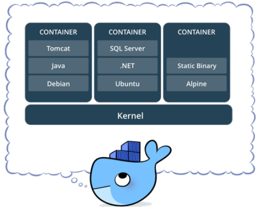
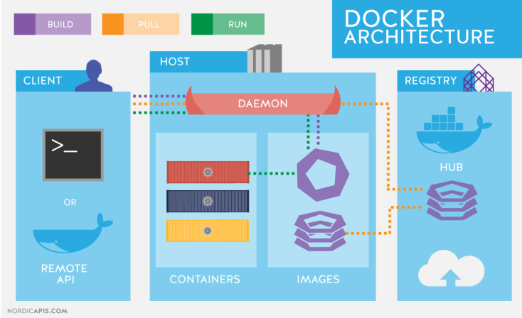
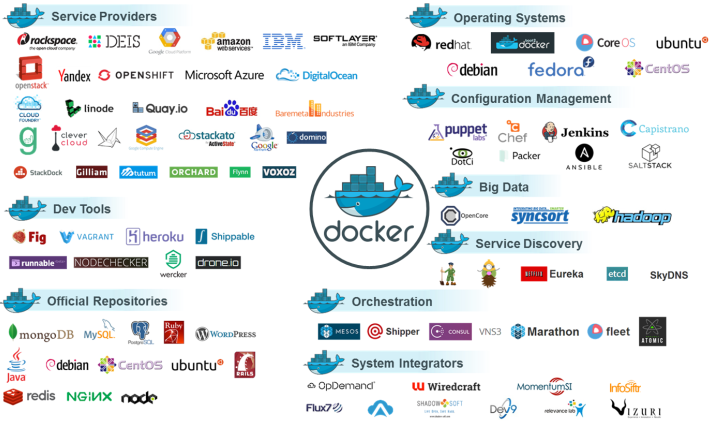

# Docker vs Virtualização

## Por que não usar uma VM

O Docker tende a utilizar menos recursos que uma VM tradicional, um dos motivos é não precisar de uma pilha completa como vemos em Comparação VMs × Containers. 

O Docker utiliza o mesmo kernel do host, e ainda pode compartilhar bibliotecas.

Mesmo utilizando o mesmo kernel é possível utilizar outra distribuição com versões diferentes das bibliotecas e aplicativos.

---

---

## VM - Virtual Machine (máquina virtual)

Recurso extremamente usado para isolamento de serviços, replicação e melhor aproveitamento do poder de processamente de uma máquina física.

---

## Devo trocar então minha VM por um container?

Nem sempre, os containers Docker possuem algumas limitações em relação as VMs:

* Todas as imagens são linux. Apesar do host poder ser qualquer SO que use ou emule um kernel linux, as imagens em si serão baseadas em linux.
* Não é possível usar um kernel diferente do host. O Docker Engine estará executando sob uma determinada versão (ou emulação) do kernel linux, e não é possível executar uma versão diferente, pois as imagens não possuem kernel.

---

## O que são containers ?

Container é o nome dado para a segregação de processos no mesmo kernel, de forma que o processo seja isolado o máximo possível de todo o resto do ambiente.

Em termos práticos são File Systems, criados a partir de uma **"imagem"** e que podem possuir também algumas características próprias.

---

---

## O que são imagens Docker ?

Uma imagem Docker é a materialização de um modelo de um sistema de arquivos, modelo este produzido através de um processo chamado **build**. 

Esta imagem é representada por um ou mais arquivos e pode ser armazenada em um repositório.

---

## Docker File Systems

O Docker utiliza file systems especiais para otimizar o uso, transferência e armazenamento das imagens, containers e volumes.

O principal é o AUFS, que armazena os dados em camadas sobrepostas, e somente a camada mais recente é gravável.

* [https://pt.wikipedia.org/wiki/Aufs]
* [https://docs.docker.com/engine/userguide/storagedriver/aufs-driver/]

---

## Arquitetura

De maneira simplificada podemos dizer que o uso mais básico do Docker consiste em:

* Ter o serviço Docker Engine rodando
* Ter acesso a API Rest do Docker Engine, normalmente através do Docker Client
* Baixar uma imagem do Docker Registry, normalmente do registry público oficial: [https://hub.docker.com]
* Instanciar um container a partir da imagem baixada

---

---

## Crescimento do Docker

A primeira versão do Docker é de 13 de março de 2013, tem se tornado cada vez mais popular e uma solução real para desenvolvedores *(manter o seu ambiente mais simples e próximo à produção)*, administradores de sistema e
ultimamente para uso enterprise, sendo avaliado pelos principais players do mercado como uma alternativa mais econômica em relação as soluções atuais *(em sua maioria virtualização)*.

---

---
