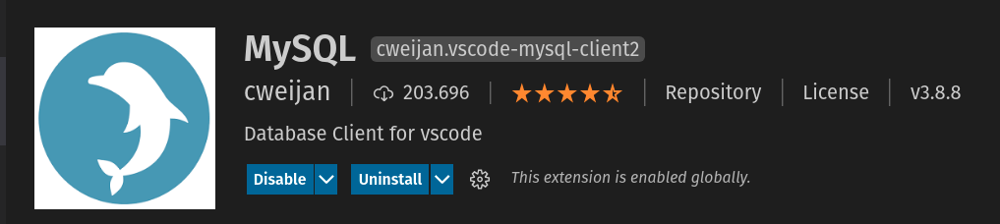
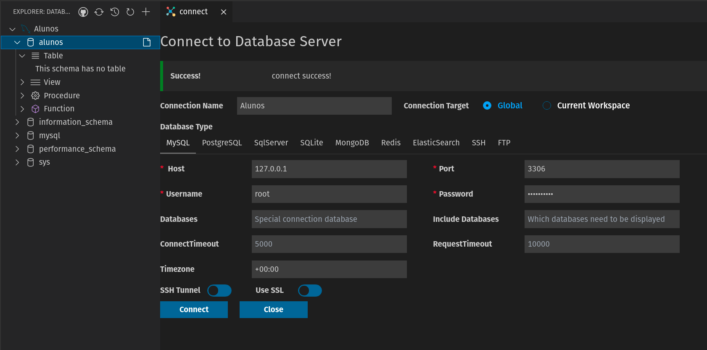

## Configurando uma imagem do Banco de dados MySql

Dentro da pasta raiz do seu projeto, crie um arquivo chamado **'docker-compose.yml'** com o conteúdo abaixo:

```
version: '3'

services:
  mysqlsrv:
    image: mysql
    environment:
      MYSQL_ROOT_PASSWORD: "MySql2021!"
      MYSQL_DATABASE: "alunos"
    ports:
      - "3306:3306"
    volumes:
      - ./.docker/volumes/mysql:/var/lib/mysql
```

## Acessando o banco de dados utilizando o vscode

Instale o plugin **Database Client for Visual Studio Code** para acessar o banco de dados MySQL:



---

Após instalar, configure e acesse o banco de dados conforme a imagem abaixo:


