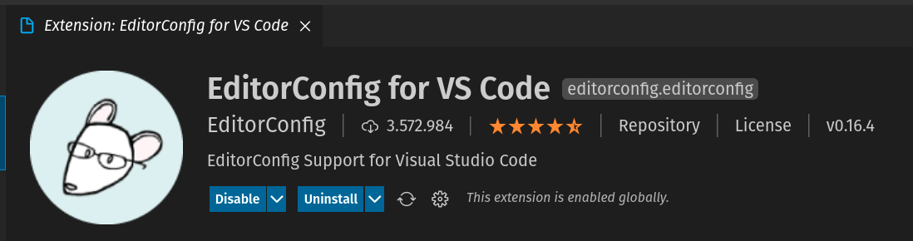

## 2. Instalar e configurar o **editorconfig** no VSCode

Abra o vscode na pasta **backend**. 
Este será nosso diretório principal nesta primeira fase da jornada.

No vscode, instale o plugin **EditorConfig for VSCode**:



Após instalar o editor, crie o arquivo **.editorconfig** na pasta raiz do projeto **backend** com o conteúdo baixo:

```
root = true

[*]
indent_style = space
indent_size = 2
end_of_line = lf
charset = utf-8
trim_trailing_whitespace = true
insert_final_newline = true
```

