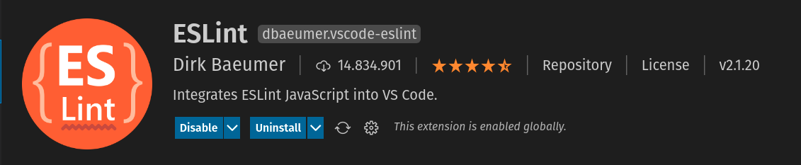
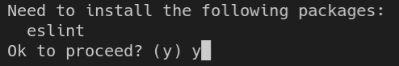
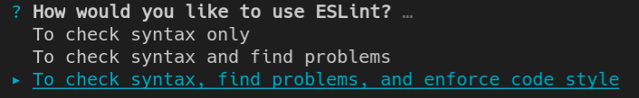
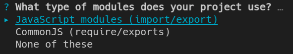
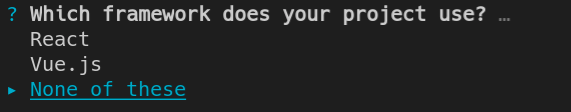
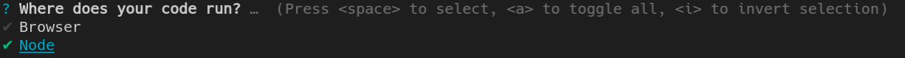
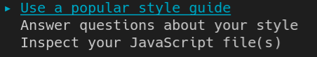
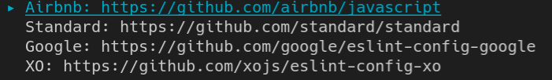
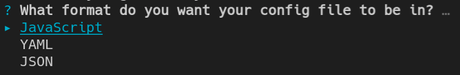
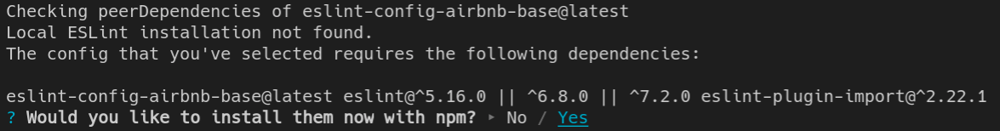

## 3. Instalar e configurar o **ESLint**

No VSCode, instale o plugin do **ESLint** :



--- 

Antes de instalar o ESLint, é necessário criar nosso projeto Nodejs com o NPM utilizando o comando abaixo:

```
npm init -y
```

--- 

Após inicializar o projeto **backend** como  um projeto Nodejs, é necessário instalar o **eslint** com o comando abaixo:

```
npx eslint --init
```

Confirme a instalação do eslint:



--- 

Configure o eslint para: 
1. verificar a sintaxe, 
2. encontrar problemas,
3. aplicar estilo ao código-fonte



--- 

Configure para utilizar módulos com **import/export**:



--- 

Configure para utilizar Nodejs:



--- 

Configure para **não** utilizar Typescript:


--- 

Configure para utilizar Node:



--- 

Configure para utilizar um **style guide** popular:



--- 

Configure para utilizar o **style guide da airbnb**:



--- 

Configure para utilizar arquivos de configuração no formato JavaScript:



--- 

Confirme a instalação dos pacotes necessários para instalar o eslint:



--- 

Após concluir estes passos, o eslint e suas dependências devem aparecer conforme a listagem abaixo dentro de seu arquivo **package.json**

```json
  "devDependencies": {
    "eslint": "^7.28.0",
    "eslint-config-airbnb-base": "^14.2.1",
    "eslint-plugin-import": "^2.23.4"
  }
```

---

Você também pode observar que um arquivo chamado **eslintrc.js** foi criado do diretório raiz da aplicação com o seguinte conteúdo:

```javascript
module.exports = {
  env: {
    es2021: true,
    node: true,
  },
  extends: [
    'airbnb-base',
  ],
  parserOptions: {
    ecmaVersion: 12,
    sourceType: 'module',
  },
  rules: {
  },
};
```

---

No arquivo de configuração do VSCode, também é preciso verificar se a propriedade de **formatar automaticamente ao salvar** está configurada para utilizar o **eslint**.

Caso não esteja, crie conforme o exemplo abaixo:

```json
  "editor.codeActionsOnSave": {
    "source.fixAll.eslint": true,
  },
```
