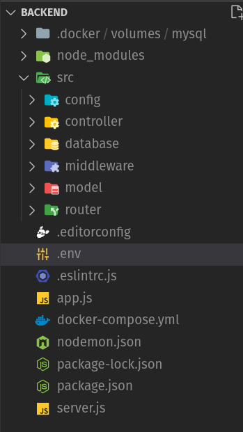
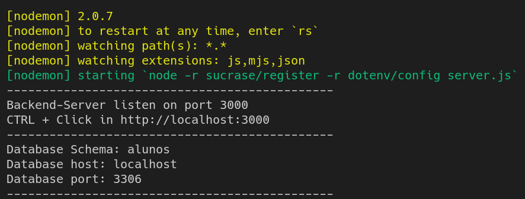
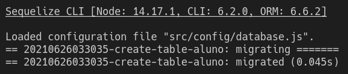
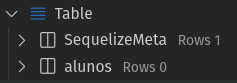

## Configurando e testando o **Sequelize**

O Sequelize é um ORM(Object/Relational Mapper) baseado em Promise para Node.js.
Suporta os dialetos **PostgreSQL**, **MySQL**, **MariaDB**, **SQLite** e **MSSQL**.

Possui recursos interessantes como:

- suporte à transações, 
- relacionamentos, 
- replicação de leitura e muito mais.

Com o Sequelize podemos:

- criar tabelas
- editar tabelas
- remover tabelas
- inserir, editar e remover dados em nosso banco de dados

Vamos instalar o **Sequelize** em conjunto com o **dotenv**.

O **dotenv** tem como função principal, possibilitar informar todas as informações necessárias referentes as credenciais de acesso/conexão ao nosso banco de dados em um arquivo chamado **.env**.

A ideia é nunca fazer **push** para repositórios remotos do github de arquivos contendo credenciais de acesso.

Expor credenciais de usuários e senhas de servidores expõe os ambientes de TI a riscos desnecessários.

---

### Instalando e configurando o **dotenv**

Execute o comando abaixo para instalar o **dotenv**:

```
npm i dotenv
```

Após a instalação, crie um aquivo chamado ".env" na raiz do projeto conforme a imagem abaixo:



Dentro do arquivo **.env**, declare variáveis de ambiente conforme a listagem abaixo para configurar as credenciais de acesso ao banco de dados:

```
DATABASE_SCHEMA=alunos
DATABASE_HOST=localhost
DATABASE_PORT=3306
DATABASE_USERNAME=root
DATABASE_PASSWORD=MySql2021!
```

Para habilitar o acesso das variáveis de ambiente em nossa aplicação, é necessário editar o arquivo **nodemon.json** conforme o exemplo abaixo:

```
{
  "execMap": {
    "js": "node -r sucrase/register -r dotenv/config"
  }
}
```

---

### Validando as configurações do **dotenv**

Edite o arquivo **server.js** para exibir algumas informações configuradas no arquivo **.env**:

```
import app from './app';

const port = 3000;
app.listen(port, () => {
  console.log('----------------------------------------------');
  console.log(`Backend-Server listen on port ${port}`);
  console.log(`CTRL + Click in http://localhost:${port}`);
  console.log('----------------------------------------------');
  console.log(`Database Schema: ${process.env.DATABASE_SCHEMA}`);
  console.log(`Database host: ${process.env.DATABASE_HOST}`);
  console.log(`Database port: ${process.env.DATABASE_PORT}`);
  console.log('----------------------------------------------');
});
```

Após efetuar as alterações, execute a aplicação para veficar se as informações de credencias aparecem no console.

```
npm run dev
```

Deve ser impresso o seguinte conteúdo no console:



---

### Garanta que seu arquivo **.env** não seja submetido a repositórios Git remotos

Crie o arquivo **.gitignore** e adicione a referência do arquivo **.env** em seu conteudo.

```
.env
```

Faça uma cópia do arquivo **.env** e nomeie este arquivo de **.env.example** com o conteudo abaixo:

```
#
# This file is a template. Rename this file to '.env' and update your database credential.
# 
DATABASE_SCHEMA=schema
DATABASE_HOST=localhost
DATABASE_PORT=3306
DATABASE_USERNAME=root
DATABASE_PASSWORD=********
```

A ideia é que somente o arquivo **.env.example** seja enviado ao repositório git remoto. Este arquivo serve apenas como um template para o arquivo **.env**.

Desta maneira, é possível recriar de forma simples o arquivo **.env** em outros ambientes sem comprometer as credenciais de acesso ao banco de dados.

---


### Instalando o **Sequelize** e **sequelize-cli**

Para instalar o **Sequelize** e o **sequelize-cli**, execute os comandos **npm** abaixo:

```
npm i sequelize
npm i -D sequelize-cli
```

Após instalar o **Sequelize**, é necessário instalar o driver especifico do banco de dados.
Segue abaixo os drivers suportados pelo **Sequelize**:

```
# MySql
npm i mysql2

# MariaDB
npm i mariadb

# Postgres
npm i pg pg-hstore

# Microsoft SQL Server
npm i tedious
```

No projeto, iremos utilizar o driver para o banco de dados MySql.
Fique a vontade para testar com outros tipos de bancos de dados.

---

### Configurando o **Sequelize**

Vamos criar na raiz do projeto, o arquivo **.sequelizerc** com o seguinte conteudo:

```
const { resolve } = require('path');

module.exports =  {
  config: resolve(__dirname, 'src', 'config', 'database.js'),
  'models-path': resolve(__dirname, 'src'. 'model'),
  'migrations-path': resolve(__dirname, 'src', 'database', 'migrations'),
  'seeders-path': resolve(__dirname, 'src', 'database', 'seeds'),
}
```

#### Parâmetros de configuração

- **config**: contém as configurações do banco de dados.
- **models-path**: contém os códigos referentes aos modelos de dados.
- **migrations-path**: conterá arquivos que tem a função de criar e alterar a estrutura de tabelas.
- **seeders-path**: terá arquivos que tem a função de alimentar ou deletar registros de tabelas.

**NOTA:** *O arquivo de configuração do Sequelize utiliza o modelo padrão do Nodejs de exportação de módulos (**module.export**)*

**DICA:** Para habilitar a proprieade **sintaxe highlight** do VSCode, siga os passos abaixo:
- CTRL+Shift+P - Change Language Mode
- Selecione: Javascript

---

### Criando o arquivo **config/database.js**

Dentro da pasta **src/config**, crie o arquivo **database.js** com o seguinte conteúdo:

```
require('dotenv').config();

module.exports = {
  dialect: 'mysql',
  host: process.env.DATABASE_HOST,
  port: process.env.DATABASE_PORT,
  username: process.env.DATABASE_USERNAME,
  password: process.env.DATABASE_PASSWORD,
  database: process.env.DATABASE_SCHEMA,
  define: {
    timestamps: true,
    underscored: true,
    underscoredAll: true,
    createdAt: 'created_at',
    updatedAt: 'updated_at',
  },
  dialectOptions: {
    timezone: '-03:00',
  },
  timezone: '-03:00',
};
```

**NOTA:** as propriedades **underscored** e **underscoredAll** tem como objetivo transformar nomes de campos no formato **camelCase** para o formato **underscored**.

**Exemplo:**
- nomeAluno (javascript) --> nome_aluno (banco de dados)

---

### Criando o arquivo de inicialização do Banco de Dados **./src/database/index.js**

O último passo para configurar o banco de dados, é criar a classe que efetivamente estabelece conexão com nosso banco de dados.

Esta classe tem como objetivo associar e inicializar cada modelo de dados de nossa aplicação backend.

Mesmo sem existir um modelo de dados criado, precisamos desta configuração para que o Sequelize valide e crie um arquivo de migração inicial (migration).

```
import Sequelize from 'sequelize';
import databaseConfig from '../config/database';

const models = [];

class Database {
  constructor() {
    this.init();
  }

  init() {
    this.connection = new Sequelize(databaseConfig);
    models.map((model) => model.init(this.connection))
      .map((model) => {
        if (model.associate) model.associate(this.connection.models);
        return model;
      });
  }
}

export default new Database();
```

---

### Criando nossa primeira migração (migration)

Precisamos entender dois conceitos importantes, que são o **migrations** e **seeds**.

- **Migrations**: *São classes que executaram promises capazes de gerar nossa estrutura na base de dados, ele irá  gerar as tabelas, relacionamentos e  campos por etapas, para cada nova tabela teremos uma nova migration, não precisa se preocupar o  migrate sabe identificar qual foi a última executada.*

- **Seeds**: *São classes que executam promises capazes de gerar dados padrões para as tabelas, seja para mockar ou gerar dados padrões para tabelas.*

Para criar uma migration -e necessário executar o seguinte comando:

```
npx sequelize migration:generate --name create-table-aluno
```

Se todas as configurações estiverem corretas, o sequelize irá criar um arquivo de migração na pasta **./src/database/migrations**.

Arquivos de migrations servem para versionar o banco de dados. Com isso, temos a possibilidade de realizar downgrades em nossa estrutura de banco de dados.

Outra vantagem, é abrir a possibilidade para que vários desenvolvedores possam criar/editar estruturas de tabelas sem impactar o time de desenvolvimento ou de testes.

---

### Criando a estrutura da tabela **Alunos**

Ao abrir nosso primeiro arquivo de migration, nos deparamos com o seguinte código:

```
'use strict';

module.exports = {
  up: async (queryInterface, Sequelize) => {
    /**
     * Add altering commands here.
     *
     * Example:
     * await queryInterface.createTable('users', { id: Sequelize.INTEGER });
     */
  },

  down: async (queryInterface, Sequelize) => {
    /**
     * Add reverting commands here.
     *
     * Example:
     * await queryInterface.dropTable('users');
     */
  }
};
```

Basicamente nos deparamos com 02 métodos: **up** e **down**

- **up**: Responsável por executar uma criação/alteração de tabela.
- **down**: Responsável por executar métodos de desfazer alterações como por exemplo, se o **up** está criando a tabela aluno, no **down** colocamos seu drop, pois é o comando que será  executado ao  reverter a migration já executada.

Vamos agora editar nosso arquivo de migração para criar a estrutura da tabela **alunos**. Nosso migration deve ficar conforme o exemplo abaixo:

```
module.exports = {
  up: async (queryInterface, Sequelize) => {
    await queryInterface.createTable('alunos', {
      id: {
        type: Sequelize.INTEGER,
        allowNull: false,
        autoIncrement: true,
        primaryKey: true,
      },
      nome: {
        type: Sequelize.STRING,
        allowNull: false,
      },
      sobrenome: {
        type: Sequelize.STRING,
        allowNull: false,
      },
      email: {
        type: Sequelize.STRING,
        allowNull: false,
      },
      idade: {
        type: Sequelize.INTEGER,
        allowNull: false,
      },
      peso: {
        type: Sequelize.FLOAT,
        allowNull: false,
      },
      altura: {
        type: Sequelize.FLOAT,
        allowNull: false,
      },
      created_at: {
        type: Sequelize.DATE,
        allowNull: false,
      },
      updated_at: {
        type: Sequelize.DATE,
        allowNull: false,
      },
    });
  },

  down: async (queryInterface) => {
    await queryInterface.dropTable('alunos');
  },
};
```

Para criar a tabela alunos em nosso banco de dados, execute o comando abaixo:

```
npx sequelize db:migrate
```

O resultado da execução do comando acima deve ser similar a imagem abaixo:



Ao verifiar nosso schema do banco de dados, devemos ter agora 02 tabelas:



---

### Criando nosso primerio **Model** (modelo de dados)

Até o momento apenas criamos a estrutura da tabela alunos.

Contudo, para que possamos inserir, editar, listar ou remover registros na tabela alunos, será necessário criar um modelo de dados.

Dentro da pasta **./src/model** crie o arquivo **Aluno.js** com o conteúdo abaixo:

```
import Sequelize, { Model } from 'sequelize';

export default class Aluno extends Model {
  static init(sequelize) {
    super.init({
      nome: Sequelize.STRING,
      sobrenome: Sequelize.STRING,
      email: Sequelize.STRING,
      idade: Sequelize.INTEGER,
      peso: Sequelize.FLOAT,
      altura: Sequelize.FLOAT,
    }, {
      sequelize,
    });
    return this;
  }
}
```

---

### Associando nosso model Aluno com o banco de dados.

Para associar nosso arquivo de modelo de dados para a entidade **Aluno**, edite o arquivo **./src/database/index.js** para que ele 
importe nosso modelo de dados, e o adicione no array **models**.

O arquivo **./src/database/index.js** deve ficar conforme o exemplo abaixo: 

```
import Sequelize from 'sequelize';
import databaseConfig from '../config/database';
import Aluno from '../model/Aluno';

const models = [Aluno];

class Database {
  constructor() {
    this.init();
  }

  init() {
    this.connection = new Sequelize(databaseConfig);
    models.map((model) => model.init(this.connection))
      .map((model) => {
        if (model.associate) model.associate(this.connection.models);
        return model;
      });
  }
}

export default new Database();
```

---

### Associando nosso banco de dados ao arquivo **App.js**

Edite o arquivo App.js e importe **./src/database** conforme o exemplo abaixo:

```
import express from 'express';
import './src/database';
import homeRouter from './src/router/homeRouter';

class App {
  constructor() {
    this.app = express();
    this.middelwares();
    this.routes();
  }

  middelwares() {
    this.app.use(express.urlencoded({ extended: true }));
    this.app.use(express.json());
  }

  routes() {
    this.app.use('/', homeRouter);
  }
}

export default new App().app;
```

Para testar se tudo está funcionando, execute a aplicação com o comando:

```
npm run dev
```

Caso tudo esteja funcionando, parabéns !
Agora é preciso apenas fazer um último ajuste. Vamos editar nossa classe **HomeController** para incluir registros na tabela **Alunos**.

---

### Editando **HomeController** para incluir registros na tabela **Alunos**

Apenas para efeitos didáticos vamos utilizar a classe HomeController para incluir registros na tabela Alunos.

Isto é algo apenas temporário, pois futuramente iremos criar uma classe controller específica para Alunos.

A ideia agora é apenas acessar via rest nossa API e verificar se estamos conseguindo incluir registros na base de dados.

Edite a classe HomeController para que fique conforme o exemplo abaixo:

```
import Aluno from '../model/Aluno';

class HomeController {
  async index(req, res) {
    const novoAluno = await Aluno.create({
      nome: 'Devmaster',
      sobrenome: 'Programmer Hero',
      email: 'devmaster@programmerhero.com.br',
      idade: 21,
      peso: 99,
      altura: 1.67,
    });
    res.json(novoAluno);
  }
}

export default new HomeController();
```

---

### Testando a criação de um novo aluno e seu retorno em JSON

Execute o servidor com o comando abaixo:

```
npm run dev
```

Crie um arquivo para testar nossa API rest em **./restclitent/homeController.http** com o conteudo abaixo:

```
http://localhost:3000/
```

Execute o RestClient e você deve receber um retorno conforme o exemplo abaixo:

```
HTTP/1.1 200 OK
X-Powered-By: Express
Content-Type: application/json; charset=utf-8
Content-Length: 214
ETag: W/"d6-BFvGNvjUUHEo8SmKpkQwhN4meYk"
Date: Sat, 26 Jun 2021 04:59:14 GMT
Connection: close

{
  "id": 1,
  "nome": "Devmaster",
  "sobrenome": "Programmer Hero",
  "email": "devmaster@programmerhero.com.br",
  "idade": 21,
  "peso": 99,
  "altura": 1.67,
  "updated_at": "2021-06-26T04:59:14.263Z",
  "created_at": "2021-06-26T04:59:14.263Z"
}
```

Verifique em seu banco de dados, e observe que um registro referente ao JSON recebido também foi criado na tabela **Alunos**.

Desta maneira configuramos e testamos a conectividade do nosso backend com o banco de dados e podemos avançar em nossa Jornada !
