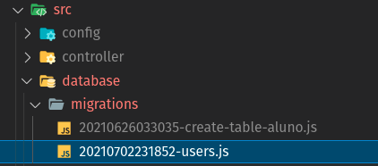
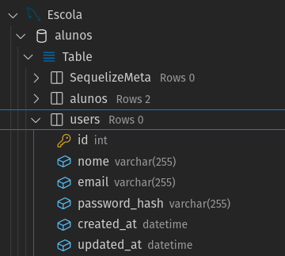
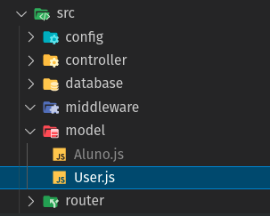

# Módulo de Autenticação

## Criando usuários

Neste capítulo iremos criar nosso módulo de autenticação.

Até o momento, apenas configuramos toda a infraestrutura necessária para a comunicação com o banco de dados e criamos um modelo para a tabela de **Alunos**.

Vamos utilizar nosso modelo e tabela de alunos em um capítulo posterior. Esta estrutura apenas foi utilizada para validar as configurações do ambiente de desenvolvimento e a conectividade com o banco de dados.

Vamos focar neste módulo em criar e autenticar usuários em nosso backend.

Isso significa que nossas rotas deverão ser autenticadas antes de serem acessadas por qualquer Rest Client APIs como o Insomnia, Postman, HTTPie, Paw, curl, dentre outros. 

---

## Criando a tabela users

Vamos começar criando a tabela de usuários.

E como criar esta tabela ? 

Vamos utilizar uma **Migration** para esta tarefa!

```
npx sequelize migration:create --name=users
```

Vamos então editar nosso arquivo de migration de usuários, localizado na pasta: **./src/database/migration/**




Código do arquivo de migração de usuários:

```javascript
module.exports = {
  up: async (queryInterface, Sequelize) => {
    await queryInterface.createTable('users', {
      id: {
        type: Sequelize.INTEGER,
        allowNull: false,
        autoIncrement: true,
        primaryKey: true,
      },
      nome: {
        type: Sequelize.STRING,
        allowNull: false,
      },
      email: {
        type: Sequelize.STRING,
        allowNull: false,
        unique: true,
      },
      password_hash: {
        type: Sequelize.STRING,
        allowNull: false,
      },
      created_at: {
        type: Sequelize.DATE,
        allowNull: false,
      },
      updated_at: {
        type: Sequelize.DATE,
        allowNull: false,
      },
    });
  },

  down: async (queryInterface) => {
    queryInterface.dropTable('users');
  },
};
```

Neste arquivo de migração temos 02 questões relevantes para entender:

1. O campo email contem o atributo **unique: true**. Isso indica que a tabela de usuários não pode conter dois ou mais usuários com o mesmo email. O email deve ser único.

2. O campo **password_hash** será utilizado para conter a senha criptografada do usuário. É de grande importância criptografar a senha do usuário antes que seja gravada na tabela. Caso contrário, haverá uma falha de segurança pois será muito fácil conhecer a senha do usuário.

Para criar a tabela **users**, vamos executar nosso arquivo de migração com o comando abaixo:

```
npx sequelize db:migrate
```

Podemos verificar que após o comando acima, a tabela users foi criada com sucesso:



Mas também é possível remover a tabela users através do comando abaixo:

```
npx sequelize db:migrate:undo
```

---

## Criando o **User Model** para a tabela **users**

Dentro da pasta **./src/model** vamos criar o arquivo **User.js**. Este arquivo deverá conter nossa classe que reprenta o modelo de dados.



O arquivo **User.js** deve conter o código abaixo:

```javascript
import Sequelize, { Model } from 'sequelize';

export default class User extends Model {
  static init(sequelize) {
    super.init({
      nome: {
        type: Sequelize.STRING,
        defaultValue: '',
        validate: {
          len: {
            args: [3, 255],
            msg: 'Campo nome deve possuir de 3 a 255 caracteres',
          },
        },
      },
      email: {
        type: Sequelize.STRING,
        defaultValue: '',
        isEmail: {
          len: {
            msg: 'Email inválido',
          },
        },
      },
      password_hash: {
        type: Sequelize.STRING,
        defaultValue: '',
      },
      password: {
        type: Sequelize.VIRTUAL,
        defaultValue: '',
        validate: {
          len: {
            args: [6, 50],
            msg: 'A senha precisa ter entre 6 a 50 caracteres',
          },
        },
      },
    }, {
      sequelize,
    });
    return this;
  }
}
```

Exitem alguns detalhes na implementação de **User.js** que não utilizamos em **Aluno.js**.

A primeira grande diferença é que em **User.js**, os estão sendo definidos como objetos mais especializados, ao invés de simplesmente **Sequelize.STRING**.

Isso é necessário para que possamos conhecer um recurso muito interessante do Sequelize: **as validações de campos**.

Podemos observar que dentro do objeto que descreve cada campo, agora existe um atributo chamado **validate**, que é também um objeto responsável por efetuar a validação dos valores que serão atribuídos a cada campo antes que sejam inseridos na **tabela users**.

Para saber mais sobre validators consulte:

- [Manual Sequelize](https://sequelize.org/master/manual/validations-and-constraints.html)
- [validator.js (GitHub)](https://github.com/validatorjs/validator.js)

A segunda diferença é que em **User.js** existe o campo **password** do tipo **Sequelize.VIRTUAL**. Este campo não existe na estrutura da **tabela users**. Ele é apenas utilizado para receber o valor da senha informada e em seguida será criptografado para o campo **password_hash**.

Para criptografar o password, será necessário primeiro instalar o módulo **bcryptjs**.

---

## Instalando o **módulo bcryptjs**

Para instalar o módulo bcrypt, execute o comando abaixo: 

```
npm i bcryptjs
```

---

## Criando um hook para criptografar a senha

Hooks (ganchos) são métodos que podemos configurar para executar em diversos pontos dos Models do Sequelize.
Por exemplo, podemos executar ganchos antes ou depois de gravar informações, antes ou depois de selects, etc.

Vamos alterar o Model **User.js** para que a senha seja criptografada antes de ser gravada na tabela Users.

Para isso siga os passos abaixo:

1. importe o bcryptjs
```javascript
import bcryptjs from 'bcryptjs';
```

2. Inclua antes do "*return this;*" do Model User o código para criptografar a senha:
```javascript
this.addHook('beforeSave', async (user) => {
  user.password_hash = await bcryptjs.hash(user.password, 8);
});

return this;
```

O código acima criptografa o conteudo de **user.password**, com 8 saltos criptográficos e armazena o conteudo em **user.password_hash**. Quanto maior for número de saltos, mais segura será criptografia, mas o tempo de processamento para a geração do hash será maior.

3. No arquivo **.eslinrc.js**, desabilite mais uma regra:
```javascript
'no-param-reassign': 'off',
```

O código do arquivo **User.js** deve ficar da seguinte maneira:

```javascript
import bcryptjs from 'bcryptjs';
import Sequelize, { Model } from 'sequelize';

export default class User extends Model {
  static init(sequelize) {
    super.init({
      nome: {
        type: Sequelize.STRING,
        defaultValue: '',
        validate: {
          len: {
            args: [3, 255],
            msg: 'Campo nome deve possuir de 3 a 255 caracteres',
          },
        },
      },
      email: {
        type: Sequelize.STRING,
        defaultValue: '',
        isEmail: {
          len: {
            msg: 'Email inválido',
          },
        },
      },
      password_hash: {
        type: Sequelize.STRING,
        defaultValue: '',
      },
      password: {
        type: Sequelize.VIRTUAL,
        defaultValue: '',
        validate: {
          len: {
            args: [6, 50],
            msg: 'A senha precisa ter entre 6 a 50 caracteres',
          },
        },
      },
    }, {
      sequelize,
    });

    this.addHook('beforeSave', async (user) => {
      user.password_hash = await bcryptjs.hash(user.password, 8);
    });

    return this;
  }
}
```

O código do arquivo **.eslintrc.js** deve ficar da seguinte maneira:

```javascript
module.exports = {
  env: {
    es2021: true,
    node: true,
  },
  extends: [
    'airbnb-base',
  ],
  parserOptions: {
    ecmaVersion: 12,
    sourceType: 'module',
  },
  rules: {
    'no-console': 'off',
    'class-methods-use-this': 'off',
    'no-param-reassign': 'off',
  },
};
```

Precisasmos também alterar o arquivo **./src/database/index.js** para adicionar o model **User** no array **models** para que o Sequelize possa fazer um link entre o objeto User (javascrip) e a tabela users do banco de dados.

O arquivo **./src/database/index.js** deve ficar da seguinte maneira:

```javascript
import Sequelize from 'sequelize';
import databaseConfig from '../config/database';
import Aluno from '../model/Aluno';
import User from '../model/User';

const models = [Aluno, User];

class Database {
  constructor() {
    this.init();
  }

  init() {
    this.connection = new Sequelize(databaseConfig);
    models.map((model) => model.init(this.connection))
      .map((model) => {
        if (model.associate) model.associate(this.connection.models);
        return model;
      });
  }
}

export default new Database();
```

---

## Criando o controller **UserController.js**

Dentro da pasta **./src/controller** vamos criar o arquivo UserController.js com o seguinte conteudo:

```javascript
import User from '../model/User';

class UserController {
  async create(req, res) {
    const novoUser = await User.create({
      nome: 'Devmaster',
      email: 'devmaster@programmerhero.com.br',
      password: 'devmaster@123',
    });
    return res.json(novoUser);
  }
}

export default new UserController();
```

Este é um controller simples e que cria sempre um usuário com as mesmas informações, mas que pemite que possamos prosseguir para realizar um teste rápido.

---

## Criando a rota **userRouter.js**

Dentro da pasta **./src/router** vamos criar o arquivo userRouter.js conforme o exemplo abaixo:

```javascript
import { Router } from 'express';
import userController from '../controller/UserController';

const router = new Router();

router.post('/', userController.create);

export default router;
```

Existe uma nomenclatura para os 05 tipos de ações que podemos ter nos controles que são muito utilizadas:

- **index** - lista todos os registros - **GET**
- **store/create** - cria um novo registro - **POST**
- **delete** - apaga um registro - **DELETE**
- **show** - mostra um registro - **GET**
- **update** - atualiza um registro - **PATCH/PUT**

---

## Fazer a chamada de **userRouter** no arquivo **app.js**

Para testar se a implementação do model, controller e router do User estão corretos, precisamos alterar o arquivo **app.js** para chamar a rota **userRouter**

Altere o arquivo **app.js** para que fique da seguinte maneira:

```javascript
import express from 'express';
import './src/database';
import homeRouter from './src/router/homeRouter';
import userRouter from './src/router/userRouter';

class App {
  constructor() {
    this.app = express();
    this.middelwares();
    this.routes();
  }

  middelwares() {
    this.app.use(express.urlencoded({ extended: true }));
    this.app.use(express.json());
  }

  routes() {
    this.app.use('/', homeRouter);
    this.app.use('/users', userRouter);
  }
}

export default new App().app;
```

## Testando o endpoint de criação de usuário 

Já estamos prontos para testar a criação de usuários.

Caso o servidor de banco de dados esteja parado, inicialize ele com o comando abaixo:

```
docker-compose up
```

Inicalize agora o backend utilizando o comando:

```
npm run dev
```

Utilizando seu client rest de preferência, realize uma chamada **POST** no endereço [http://localhost:3000/users].

Caso você utilize a extensão do RestClient no VSCode, crie um arquivo com extensão **.http** e com o conteúdo abaixo: 

```
POST http://localhost:3000/users
```

Executando RestClient, você deverá receber um retorno parecido com o resultado abaixo:

```javascript
HTTP/1.1 200 OK
X-Powered-By: Express
Content-Type: application/json; charset=utf-8
Content-Length: 255
ETag: W/"ff-ojBYv+c4AWK5esrwCdSu/kMhnoo"
Date: Sat, 03 Jul 2021 03:23:15 GMT
Connection: close

{
  "password_hash": "$2a$08$6tScnx6fZ8zklrNMZqhHieewW9clmwB9dhXMrPqPb/tChko6xwKza",
  "id": 1,
  "nome": "Devmaster",
  "email": "devmaster@programmerhero.com.br",
  "password": "devmaster@123",
  "updated_at": "2021-07-03T03:23:15.578Z",
  "created_at": "2021-07-03T03:23:15.578Z"
}
```

## Tradando exceções no endpoint de usuário

Podemos observar que ao tentar inserir o mesmo usuário novamenten ocorre um erro:

```
Executing (default): INSERT INTO `users` (`id`,`nome`,`email`,`password_hash`,`created_at`,`updated_at`) VALUES (DEFAULT,?,?,?,?,?);
(node:24288) UnhandledPromiseRejectionWarning: SequelizeUniqueConstraintError: Validation error...
```

Esse erro ocorre por causa do campo **email**, que está configurado como chave única na tabela de ususários.

Uma maneira simples de tratar a exceção e retornar um erro ao client REST, é utilizar a estrutura de tratamento de exceções try...catch.

Vamos editar o arquivo UserController.js para contemplar esta nova funcionalidade:

```javascript
import User from '../model/User';

class UserController {
  async create(req, res) {
    try {
      const novoUser = await User.create({
        nome: 'Devmaster',
        email: 'devmaster@programmerhero.com.br',
        password: 'devmaster@123',
      });
      return res.json(novoUser);
    } catch (e) {
      return res.status(400).json('Ops! Ocorreu um erro.');
    }
  }
}

export default new UserController();
```

Agora, ao executar novamente nosso endpoint de usuários, é possível receber o erro que configuramos.

```javascript
HTTP/1.1 400 Bad Request
X-Powered-By: Express
Content-Type: application/json; charset=utf-8
Content-Length: 24
ETag: W/"18-U5RkIu5wGKkikS0Sx3aGMoybvvc"
Date: Fri, 30 Jul 2021 22:38:28 GMT
Connection: close

"Ops! Ocorreu um erro."
```

Mas ainda existe um ponto de melhoria. Não é indicado retornar mensagens de erros genéricas. 
Sempre que possível, é recomendado retornar o erro informado na exceção.

Se analizarmos o conteúdo da exceção através de um **console.log(e)**, veremos no console um array contendo todas as informações sobre os erros de validação:

```javascript
errors: [
  ValidationErrorItem {
    message: 'users.email must be unique',
    type: 'unique violation',
    path: 'users.email',
    value: 'devmaster@programmerhero.com.br',
    origin: 'DB',
    instance: [User],
    validatorKey: 'not_unique',
    validatorName: null,
    validatorArgs: []
  }
],
```

Vamos novamente alterar o arquivo **UserController.js** para retornar a descrição do erro que encontra-se dentro da propriedade **ValidationErrorItem.message**:

```javascript
import User from '../model/User';

class UserController {
  async create(req, res) {
    try {
      const novoUser = await User.create({
        nome: 'Devmaster',
        email: 'devmaster@programmerhero.com.br',
        password: 'devmaster@123',
      });
      return res.json(novoUser);
    } catch (e) {
      return res.status(400).json(
        e.errors.map(
          (error) => error.message,
        ),
      );
    }
  }
}

export default new UserController();
```

Agora ao executar novamente o endpoint do usuário, iremos receber a mensagem de erro informada pela exceção:

```javascript
HTTP/1.1 400 Bad Request
X-Powered-By: Express
Content-Type: application/json; charset=utf-8
Content-Length: 30
ETag: W/"1e-A4romyT9sA3n0PZyuag3+iPrqLg"
Date: Fri, 30 Jul 2021 23:00:48 GMT
Connection: close

[
  "users.email must be unique"
]
```

Mas ainda é possível melhorar a mensagem de retorno. Podemos customizá-la conforme nossas necessidades!

Vamos alterar a mensagem de erro para: "Existe um ususário cadastrado com este email".

Para isso, é necessário alterar o arquivo **User.js** para contemplar esta necessidade. 

É ncessário criar um objeto **unique** dentro da estrutura do campo **email** com a propriedade **msg** contendo o texto desejado.

A configuração do campo email deve ficar como o exemplo abaixo dentro do arquivo **User.js**:

```javascript
  email: {
    type: Sequelize.STRING,
    defaultValue: '',
    unique: {
      name: 'users.email',
      msg: 'Existe um ususário cadastrado com este email',
    },
    isEmail: {
      len: {
        msg: 'Email inválido',
      },
    },
  },
```

Desta maneira o resultado obtido agora ao consumir o enpoint será:

```javascript
HTTP/1.1 400 Bad Request
X-Powered-By: Express
Content-Type: application/json; charset=utf-8
Content-Length: 49
ETag: W/"31-9Lb4XdElDIOoXt6PEInva15BFR4"
Date: Fri, 30 Jul 2021 23:29:07 GMT
Connection: close

[
  "Existe um ususário cadastrado com este email"
]
```

Para concluir, vamos apenas encapsular todos os erros dentro de um objeto chamado **errors**.

Esta é uma boa prática para que os desenvolvedores de frontends saibam que dentro da estrutura **errors**, estarão contidos todos os erros retornados pelo backend.

Para isso, vamos alterar novamente o arquivo **UserController.js** conforme o exemplo abaixo:

```javascript
import User from '../model/User';

class UserController {
  async create(req, res) {
    try {
      const novoUser = await User.create({
        nome: 'Devmaster',
        email: 'devmaster@programmerhero.com.br',
        password: 'devmaster@123',
      });
      return res.json(novoUser);
    } catch (e) {
      return res.status(400).json({
        errors: e.errors.map(
          (error) => error.message,
        ),
      });
    }
  }
}

export default new UserController();
```

Após executar novamente nosso endpoint, teremos no resultado nossa estrutura de erros para a criação de usuário completa:

```javascript
HTTP/1.1 400 Bad Request
X-Powered-By: Express
Content-Type: application/json; charset=utf-8
Content-Length: 60
ETag: W/"3c-17MkJSmJWgM4FPs740RIAIsYEiQ"
Date: Fri, 30 Jul 2021 23:37:35 GMT
Connection: close

{
  "errors": [
    "Existe um ususário cadastrado com este email"
  ]
}
```

## Criando usuário através do client REST

Até o momento, estamos sempre enviando os dados através de um objeto fixo dentro da classe UserController.js.
Esta não é a maneira correta de fazer isso.

Para corrigir este detalhe, vamos precisar alterar a classe **UserController.js** para receber as informações do usuário através do corpo da requisição.

Vamos editar o arquivo **UserController.js** para contemplar este ajuste:

```javascript
import User from '../model/User';

class UserController {
  async create(req, res) {
    try {
      const novoUser = await User.create(req.body);
      return res.json(novoUser);
    } catch (e) {
      return res.status(400).json({
        errors: e.errors.map(
          (error) => error.message,
        ),
      });
    }
  }
}

export default new UserController();
```

E utilizando o **REST Client** no VSCode, podemos agora enviar um novo usuário para cadastrar no banco de dados enviando um JSON com as informações do usuário conforme o exemplo abaixo:

```javascript
POST http://localhost:3000/users
content-type: application/json

{
  "nome": "Wolverine",
  "email": "logan@gmail.com",
  "password": "logan@123"
}
```

E como retorno de nosso endpoint de cadastro de usuários, iremos receber a resposta do backend conforme o exemplo abaixo:

```javascript
HTTP/1.1 200 OK
X-Powered-By: Express
Content-Type: application/json; charset=utf-8
Content-Length: 236
ETag: W/"ec-HMSCEdtYH10YynCkzshK83wIHSM"
Date: Fri, 30 Jul 2021 23:55:40 GMT
Connection: close

{
  "password_hash": "$2a$08$F3Fgap4N1F8fpsfzSyGv2.Vj.q3K5TPFOkxn1nR.RiZ4rFnB8g7IO",
  "id": 28,
  "nome": "Wolverine",
  "email": "logan@gmail.com",
  "password": "logan@123",
  "updated_at": "2021-07-30T23:55:40.020Z",
  "created_at": "2021-07-30T23:55:40.020Z"
}
```
