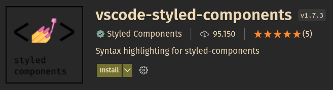

# Styled Components

Trata-se de uma biblioteca (lib) que nos permite escrever códigos CSS dentro do JavaScript.
Dessa maneira não existe a necessidade importanr arquivos .css em páginas JSX.
Com o Styled Components também ganhamos de brinde compatibilidade de browsers.
Outra vantagem é que Styled Components cria um hash nas classes CSS, assim, cada componente conhece apenas o seu CSS, uma mudança em um componente será refletida somente nele.

---

## Instalando o Styled Components

Para instalar o styled-components, utilize o comando abaixo:

```
npm install styled-components
```

---

## Instalando o vscode-styled-components plugin

Este plugin é extremamente necessário para trabalhar com Styled Components no VSCode.
Ele é responsável por fazer syntax highlighting nos códigos do Systled Components, dando uma grande contribuição visual para trabalhar com o código css.



---

## Criando um componente básico

Dentro de ```/src/pages```, vamos criar a pasta ```Login``` contendo o arquivo ```index.jsx``` com o seguinte conteúdo:

```jsx
export default function Login() {
  return <h1>Login</h1>;
}
```

Podemos perceber que este é uma página que retorna um simples título: "Login".

Vamos agora alterar o arquivo ```/src/App.jsx``` para exibir o componente criado acima:

```jsx
import Login from './pages/Login';

function App() {
  return <Login />;
}

export default App;
```

Inicie a aplicação com o comando:
```
npm start
```

Agora podemos ver no navegador que o componente ```Login``` foi renderizado com sucesso.

---

## Criando estilos para o componente ```Login```

Vamos criar o arquivo ```styled.js``` dentro da pasta ```/src/pages/Login``` com o seguinte conteúdo:

```javascript
import styled from 'styled-components';

export const Title = styled.h1`
  color: red;
`;
```

O que fizemos até agora, foi criar um componente chamado ```Title``` que herda propriedades de ```styled.h1``` e atribui a cor vermelha ao texto.

Para que possamos ver esse novo estilo em ação, precisamos alterar o arquivo ```/src/pages/Login.tsx``` da seguinta maneira:

```jsx
import { Title } from './styled';

export default function Login() {
  return <Title>Login</Title>;
}
```

---

## Criando uma propriedade para modificar a cor do texto

Uma das grandes vantagens do Styled Components possui em comparação com o CSS, é que possibilidade de criar propriedades em seus componentes e facilitar a criação de mudanças condicionais de estilos.
Vamos fazer uma pequena demonstração desse diferencial, criando uma propriedade booleana para configurar a cor do texto do compoente ```Title```.

Vamos começar alterando o arquivo ```/src/pages/Login.tsx``` criando uma nova propriedade, chamada ```isRed``` para modificar a cor do texto:

```jsx
import { Title } from './styled';

export default function Login() {
  return <Title isRed={true}>Login</Title>;
}
```

Caso a propriedade ```isRed={true}```, então a cor da fonte do componente ```Titulo``` deve ser vermelha. Caso contrário, deve ser azul.

Para contemplar esse comportamento, vamos editar o arquivo ```/src/pages/Login/styled.js``` para conter o seguinte código:

```jsx
import styled from 'styled-components';

export const Title = styled.h1`
  color: ${(props) => (props.isRed ? 'red' : 'blue')};
`;
```

Alterando o arquivo ```/src/pages/Login.tsx``` para passar o valor ```false``` para ```isRed```, a cor do texto deve ser renderizada como azul:

```jsx
import { Title } from './styled';

export default function Login() {
  return <Title isRed={false}>Login</Title>;
}
```

Esta é uma pequena amostra do que o Sytled Components pode fazer, trazendo maior dinamismo para os estilos das páginas e componentes.

---

## Criando estilos globais para a aplicação

Podemos também criar estilos globais para nossa aplicação utilizando ```Styled Components```. Estilos globais garantem um comportamento padrão para todas as páginas e componentes do projeto, facilitando a manutenção e centralizando grande parte dos estilos que podem se tornar repetitivos.

Vamos criar um novo diretório: ```/src/styles``` para conter nosso estilo global.
Crie o arquivo ```GlobalStyles.js``` dentro de ```/src/styles``` com o seguinte conteúdo:

```javascript
import { createGlobalStyle } from 'styled-components';

export default createGlobalStyle`
  * {
    margin: 0;
    padding: 0;
    outline: none;
    box-sizing: border-box;
  }
`;
```

Para utilizar o estilo global, edite o arquivo /src/App.js para que fique conforme abaixo:

```jsx
import Login from './pages/Login';
import GlobalStyles from './styles/GlobalStyles';

function App() {
  return (
    <>
      <Login />
      <GlobalStyles />
    </>
  );
}

export default App;
```

Ao executar novamente a aplicação poderemos observar que as configurações globais estão aplicadas.

Vamos continuar a configurar mais alguns detalhes nas configurações globais.

Edite o arquivo ```/src/styles/GlobalStyles.js``` da seguinte maneira:

```javascript
import { createGlobalStyle } from 'styled-components';

export default createGlobalStyle`
  * {
    margin: 0;
    padding: 0;
    outline: none;
    box-sizing: border-box;
  }

  body {
    font-family: sans-serif;
  }

  html, body, #root {
    height: 100%;
  }

  button {
    cursor: pointer;
  }

  a {
    text-decoration: none;
  }

  ul {
    list-style: none;
  }
`;
```

---

## Criando um componente ```Container``` nas configurações globais

Uma técnica muito utilizada, é criar um compoente do tipo Container utilizando Styled Components.
Vamos criar este componente dentro das configurações globais.

O arquivo ```/src/styles/GlobalStyles.js``` deve ser alterado conforme o exemplo abaixo:

```javascript
import styled, { createGlobalStyle } from 'styled-components';

export default createGlobalStyle`
  * {
    margin: 0;
    padding: 0;
    outline: none;
    box-sizing: border-box;
  }

  body {
    font-family: sans-serif;
    background: #eee;
  }

  html, body, #root {
    height: 100%;
  }

  button {
    cursor: pointer;
  }

  a {
    text-decoration: none;
  }

  ul {
    list-style: none;
  }
`;

export const Container = styled.section`
  max-width: 360px;
  background: #fff;
  margin: 30px auto;
  padding: 30px;
  border-radius: 8px;
  box-shadow: 0 0 10px rgba(0, 0, 0, 0.1);
`;
```

Vamos aplicar nosso componente Container em nossa página de Login.

Para isso, altere o arquivo ```/src/pages/Login/index.tsx``` da seguinte manaira:

```jsx
import { Container } from '../../styles/GlobalStyles';
import { Title } from './styled';

export default function Login() {
  return (
    <Container>
      <Title isRed>Login</Title>
    </Container>
  );
}
```

---

## Configurando a paleta de cores da aplicação

É interessante criar uma paleta de cores da aplicação para facilitar a implementação e a manutenção caso seja necessário alterar a paleta de cores.

Dentro da pasta vamos criar o arquivo ```/src/styles/colors.js``` com o seguinte conteúdo:

```javascript
export const primaryColor = '#C3073F';
export const primaryDarkColor = '#1A1A1D';
export const successColor = '#0197F6';
export const infoColor = '#0197F6';
export const errorColor = '#F2AF29';
export const warnColor = '#F2AF29';
```

Podemos agora importar as cores dentro do arquivo ```GlobalStyles.js```:

```javascript
import styled, { createGlobalStyle } from 'styled-components';
import { primaryColor, primaryDarkColor } from './colors';

export default createGlobalStyle`
  * {
    margin: 0;
    padding: 0;
    outline: none;
    box-sizing: border-box;
  }

  body {
    font-family: sans-serif;
    background: ${primaryDarkColor};
    color: ${primaryColor};
  }

  html, body, #root {
    height: 100%;
  }

  button {
    cursor: pointer;
    background: ${primaryColor};
    border: none;
    color: #fff;
    padding: 10px 20px;
    border-radius: 4px;
    font-weight: 700;
  }

  a {
    text-decoration: none;
    color: ${primaryColor}

  ul {
    list-style: none;
  }
`;

export const Container = styled.section`
  max-width: 360px;
  background: #fff;
  margin: 30px auto;
  padding: 30px;
  border-radius: 8px;
  box-shadow: 0 0 10px rgba(0, 0, 0, 0.1);
`;
```