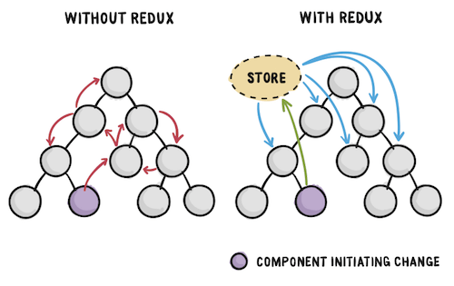
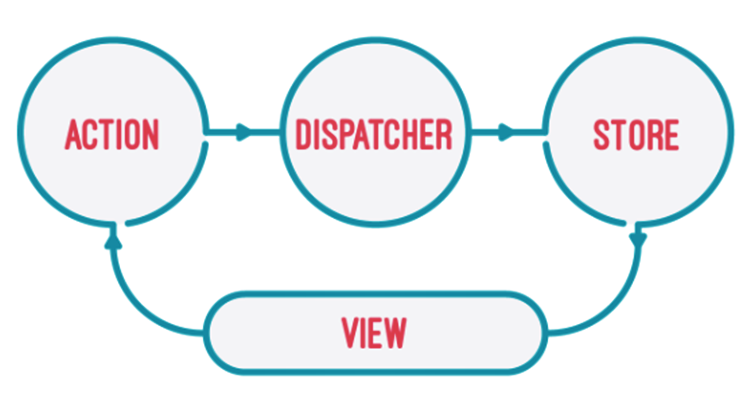
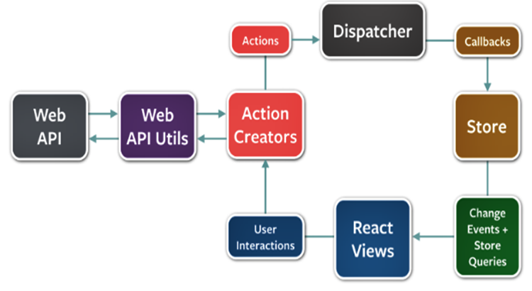

# Gerencimento de estado com Redux

**Redux** é uma biblioteca para armazenamento de estados de aplicações JavaScript, criado por **Dan Abramov** e **Andrew Clark**.

É baseado na implementação do **Flux**, uma arquitetura criada pelo Facebook para contribuir com as aplicações de User Interface, utilizando o conceito de ``fluxo de dados unidirecional``.

## Por que utilizar Redux ?

Desenvolvedores iniciantes não tem uma visão abrangente sobre as complexidades que ocorrem quando uma aplicação começa a aumentar.

A imagem abaixo tenta de forma resumida mostrar como a complexidade em gerenciar o estado da aplicação sem utilizar redux pode ocorrer.

---



---

Observem que com Redux, um componente ao atualizar o estado, simplesmente atualiza o ``Store``, sem precisar se preocupar com os demais componentes que também compartilham informações com o ``Store``.

Existem um maior desacoplamento, e testes unitários podem ser aplicados de forma mais eficiente.

---

## Arquitetura por trás do Redux

Uma visão simples da estrutura da implementação ```Flux``` em que o Redux é basedo seria algo como:

---



---

- `Views` – A interface do usuário, renderiza e cuida das interações com o usuário, de onde partem os callbacks para criar as actions.
- `Actions` – Eventos que passam os dados para o dispatcher.
- `Dispatcher` – Recebe os dados e envia para todos os stores registrados para atender a uma action específica.
- `Stores` – Recebe as actions contendo os dados e emite eventos. Os eventos devem atualizar os dados dos states, fazendo com que as `Views` sejam renderizadas novamente.

É claro que estes conceitos são um resumo geral de como se comporta o **Redux** com base na arquitetura **Flux**.

Vamos olhar agora a arquitetura do **Redux** de uma maneira mais abrangente.

## Fluxo de execução da arquitetura Redux

---



---

O primeiro ponto a ser observado, é que a `action`, `dispatcher`, `store` e `view` são independentes com **entradas** e **saídas** específicas.

O segunto ponto é o fluxo da informação.

Vamos tomar como exemplo um cadastro de alunos: **Adicionar um novo aluno a uma lista já existente**

1. Deve existir uma `função de callback`, que criará uma `action` com os `dados necessários` e envia como um objeto para o `dispatcher`.

2. O `dispatcher`, que tem registrado qual `store` receberá as informações, com base na `action` recebida e envia os dados para atualizar o `store`.

3. O `store` é onde toda a lógica do negócio está. Ao ser atualizado, o `store` deve atualizar a view retornando os novos valores.

